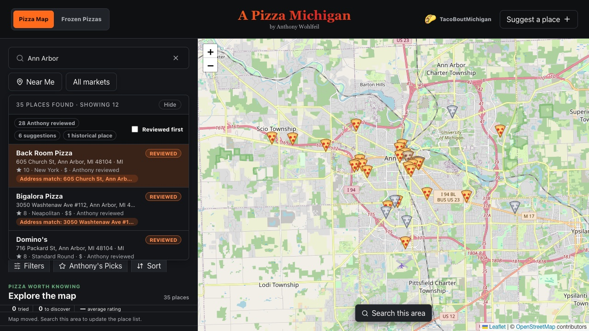
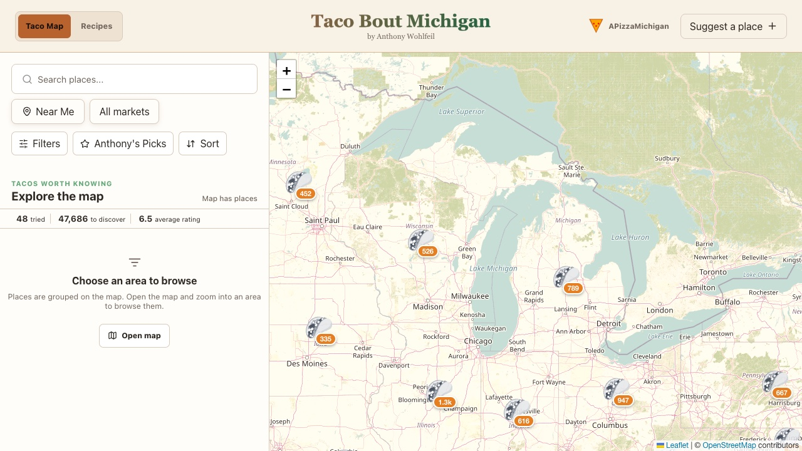

# A Pizza Michigan

[A Pizza Michigan](https://www.apizzamichigan.com) is a personal project for keeping track of pizza places I have tried and finding new ones. It started as a spreadsheet and gradually became a map and directory with more than 200,000 pizza and taco records.

  
  

The same application also powers [TacoBoutMichigan](https://www.apizzamichigan.com/tacos), with separate data, filters, and styling.

## Project overview

- Search and filter pizza and taco places on an interactive map
- Browse my ratings, notes, recommendations, and pizza style classifications
- Suggest places for review
- Track frozen pizzas and taco recipes alongside the main maps

## Data pipeline

The map is backed by jobs that collect, normalize, match, and classify place data from several sources. Some classification runs locally with Ollama. Updates pass through validation and review before they are published to the public Supabase tables.

The production Pizza and Taco jobs now live in the public [Map Data Aggregation and Enhancement Pipeline](https://github.com/Antwohlf/map-data-aggregation-enhancement-pipeline). That repository owns the reusable execution, adapters, job state, and artifacts. This repository still owns the product schemas, ratings, editorial review, and final publication rules.

I have used AI coding agents throughout much of the recent development, particularly for implementation, refactoring, and test coverage. I review the resulting changes and production data decisions.

## Stack

React, Node.js, Leaflet, Supabase, and PostgreSQL. The external pipeline uses
Ollama for local classification.

## More detail

- [Repository structure](docs/REPO_STRUCTURE.md)
- [Application and pipeline boundary](docs/PIPELINE_BOUNDARY.md)
- [Data dictionary](docs/DATA_DICTIONARY.md) and [source policy](docs/DATA_SOURCES.md)
- [Website deployment](docs/DEPLOYMENT.md)
- [Contributing](CONTRIBUTING.md)
- [Security policy](SECURITY.md) and [public repository maintenance](docs/PUBLIC_RELEASE.md)
