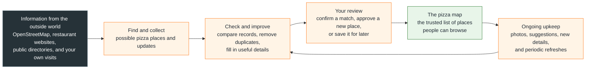
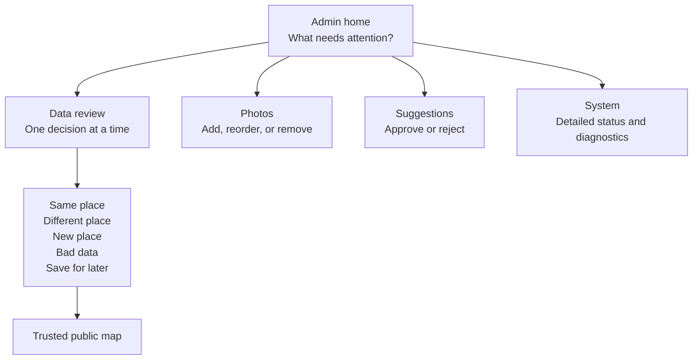
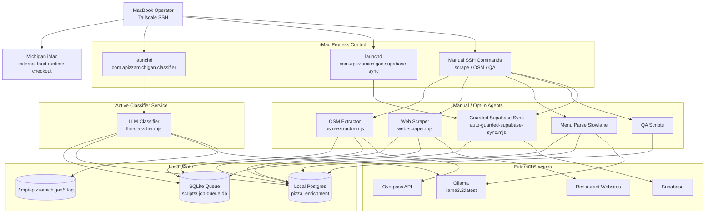

# APizzaMichigan: How the System Works

> The scheduled compatibility runtime now lives in the external pipeline
> repository under `packages/food-runtime`. App-local script paths shown below
> describe retained compatibility interfaces and should not be used to install
> production services from this checkout.

This is the plain-language view of the project. It shows where information comes
from, how it gets checked, and what eventually appears on the public map.

## The Simple Picture

## What Each Step Means

| Step | In everyday language |
|---|---|
| **Find and collect** | The system looks for pizza places and changes from trusted sources. |
| **Check and improve** | It compares names, addresses, phone numbers, websites, and locations so the same place is not added twice. It also gathers menus, hours, prices, and pizza style when available. |
| **Your review** | You make the final call when a source might be the same place, a genuinely new place, bad information, or a business that replaced an older one. |
| **The pizza map** | This is the clean, public list used by the website. It contains places people can actually find and use. |
| **Ongoing upkeep** | New photos, suggestions, closures, and updated restaurant information come back through the same checking process. |

## The Important Rule

Outside sources can **suggest** changes. They do not silently rewrite your personal
history. Your visits, ratings, notes, and photos stay attached to the place you
reviewed unless you deliberately choose a historical replacement action.

## What You See as the Owner

The everyday workflow is intentionally short. Technical reports, source details,
and import controls remain available, but they are kept out of the main review
path.

## Current Project Shape

## Current Production Shape

## Data Flow

1. Supabase remains the public production database.
2. The iMac maintains local Postgres (`pizza_enrichment`) as the enrichment working database.
3. SQLite `scripts/.job-queue.db` tracks enrichment jobs and worker state.
4. The first launchd-managed service runs only classification jobs.
5. Supabase sync is launchd-managed through guarded health, QA, readiness,
   dry-run, and protected-field gates.

## Operational Defaults

- Remote control: `ssh apizza-imac`
- Classifier model: `llama3.2:latest`
- Classifier output cap: `OLLAMA_NUM_PREDICT=80`
- Classifier timeout: `OLLAMA_TIMEOUT_MS=240000`
- Sync service: `com.apizzamichigan.supabase-sync`, one guarded 100-row batch every 30 minutes
- OSM source refresh: launchd-managed through the bounded source pipeline
- Website scraping: launchd-managed through the single scraper worker
- Menu parsing: paused/manual slowlane

## Key Files

| Component | Path |
|-----------|------|
| iMac runbook | `docs/IMAC_PIPELINE_RUNBOOK.md` |
| launchd templates | `infra/local/launchd/` |
| classifier health report | `scripts/ops/classifier-health-report.mjs` |
| classification QA report | `scripts/ops/classification-qa-report.mjs` |
| status report | `scripts/ops/home-status-report.mjs` |
| stale worker cleanup | `scripts/ops/stale-worker-cleanup.mjs` |
| bounded classifier report | `scripts/ops/classifier-batch-report.mjs` |
| classifier | external `packages/food-runtime/scripts/enrichment/agents/llm-classifier.mjs` |
| queue | external `packages/food-runtime/scripts/enrichment/queue.mjs` |
| guarded sync | external `packages/food-runtime/scripts/ops/auto-guarded-supabase-sync.mjs` |
| direct sync engine | external `packages/food-runtime/scripts/sync-local-to-supabase.mjs` |
| archived legacy pipeline | `scripts/enrichment/archive/` |
