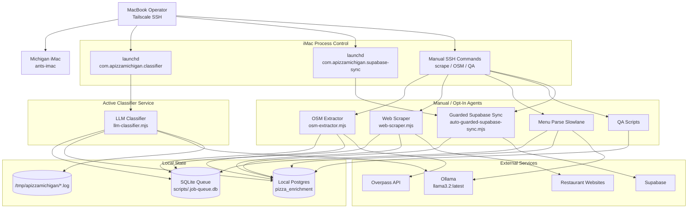

# APizzaMichigan Local Enrichment System

## Current Production Shape

## Data Flow

1. Supabase remains the public production database.
2. The iMac maintains local Postgres (`pizza_enrichment`) as the enrichment working database.
3. SQLite `scripts/.job-queue.db` tracks enrichment jobs and worker state.
4. The first launchd-managed service runs only classification jobs.
5. Supabase sync is launchd-managed through guarded health, QA, readiness,
   dry-run, and protected-field gates.

## Operational Defaults

- Remote control: `ssh apizza-imac`
- Classifier model: `llama3.2:latest`
- Classifier output cap: `OLLAMA_NUM_PREDICT=80`
- Classifier timeout: `OLLAMA_TIMEOUT_MS=240000`
- Sync service: `com.apizzamichigan.supabase-sync`, one guarded 100-row batch every 30 minutes
- Scrape/OSM services: manual only in this phase

## Key Files

| Component | Path |
|-----------|------|
| iMac runbook | `docs/IMAC_PIPELINE_RUNBOOK.md` |
| launchd templates | `infra/local/launchd/` |
| classifier health report | `scripts/ops/classifier-health-report.mjs` |
| classification QA report | `scripts/ops/classification-qa-report.mjs` |
| status report | `scripts/ops/home-status-report.mjs` |
| stale worker cleanup | `scripts/ops/stale-worker-cleanup.mjs` |
| bounded classifier report | `scripts/ops/classifier-batch-report.mjs` |
| classifier | `scripts/enrichment/agents/llm-classifier.mjs` |
| queue | `scripts/enrichment/queue.mjs` |
| guarded sync | `scripts/ops/auto-guarded-supabase-sync.mjs` |
| direct sync engine | `scripts/sync-local-to-supabase.mjs` |
| archived legacy pipeline | `scripts/enrichment/archive/` |
