# apizzamichigan — Local-First Enrichment System

## Mermaid Diagram

```mermaid
graph TD
    subgraph "OpenClaw Cron Jobs"
        CK["Coordinator Keepalive<br/>(every 5 min)"]
        WK["Watchdog Keepalive<br/>(every 5 min)"]
        HR["Hourly Status Report<br/>(every hour → Discord)"]
        MP["Slowlane menu_parse<br/>(cron)"]
        QA["QA Sample/Apply<br/>(cron)"]
    end

    subgraph "Long-Running Processes"
        COORD["Coordinator<br/>(coordinator.mjs)"]
        WD["Watchdog<br/>(watchdog.mjs)"]
    end

    subgraph "Workers (forked by Coordinator)"
        OSM["OSM Extractor<br/>(1 worker, batched)"]
        SCR["Web Scraper<br/>(1-3 workers)"]
        CLS["LLM Classifier<br/>(1-2 workers)"]
    end

    subgraph "Data Stores"
        SQLITE[("SQLite .job-queue.db<br/>WAL mode, 20s busy timeout<br/>jobs · workers · control · stats")]
        PG[("Local Postgres<br/>pizza_enrichment<br/>pizza_places · taco_places")]
        CACHE[(".osm-id-cache.json<br/>(~5.8 MB, prebuilt)")]
    end

    subgraph "External Services"
        OVERPASS["Overpass API<br/>(3 endpoints, round-robin)"]
        NOMINATIM["Nominatim<br/>(reverse geocode)"]
        WEBSITES["Restaurant Websites"]
        OLLAMA["Ollama (local)<br/>llama3.2:latest default<br/>qwen2.5:7b optional"]
        SUPABASE["Supabase<br/>(daily sync target)"]
    end

    subgraph "Visibility"
        DASH["Dashboard<br/>localhost:3456"]
        DISCORD["Discord<br/>#proj-apizzamichigan🍕"]
    end

    %% Keepalive chains
    CK -- "pgrep → spawn if dead" --> COORD
    WK -- "pgrep → spawn if dead" --> WD

    %% Coordinator spawns workers
    COORD -- "fork + IPC" --> OSM
    COORD -- "fork + IPC" --> SCR
    COORD -- "fork + IPC" --> CLS

    %% Watchdog monitors
    WD -- "heartbeat age check<br/>kill coordinator if stuck" --> COORD
    WD -. "reads heartbeats" .-> SQLITE

    %% Queue interactions
    COORD -- "populate from cache" --> SQLITE
    COORD -- "reads" --> CACHE
    OSM -- "claim/complete/fail" --> SQLITE
    SCR -- "claim/complete/fail" --> SQLITE
    CLS -- "claim/complete/fail" --> SQLITE

    %% Data flow: OSM → Postgres
    OSM -- "Overpass query<br/>(batch 10, 10-15s delay)" --> OVERPASS
    OSM -- "reverse geocode" --> NOMINATIM
    OSM -- "write tags, addr, coords" --> PG

    %% Data flow: Scrape → Postgres
    SCR -- "fetch + cheerio parse" --> WEBSITES
    SCR -- "write scrape_notes,<br/>website_cache" --> PG

    %% Data flow: Classify → Postgres
    CLS -- "chain override first,<br/>then Ollama JSON" --> OLLAMA
    CLS -- "write style, price,<br/>brand, confidence" --> PG

    %% Slowlane
    MP -- "claim menu_parse job" --> SQLITE
    MP -- "Ollama deep parse" --> OLLAMA
    MP -- "write menu_data" --> PG

    %% QA
    QA -- "sample recent rows" --> PG
    QA -- "apply corrections" --> PG

    %% Hourly report
    HR -- "read queue stats" --> SQLITE
    HR -- "read row counts" --> PG
    HR -- "post delta report" --> DISCORD

    %% Dashboard
    DASH -- "reads" --> PG
    DASH -- "reads" --> SQLITE

    %% Pause/resume
    SQLITE -- "control table<br/>pause_osm_extract<br/>pause_scrape<br/>pause_classify<br/>pause_menu_parse" --> COORD

    %% Sync
    CLS -. "daily-sync worker" .-> SUPABASE

    %% Styling
    style SQLITE fill:#f9f,stroke:#333
    style PG fill:#bbf,stroke:#333
    style OLLAMA fill:#ffa,stroke:#333
```

## How It Works (Short Version)

### Data Flow
1. **OSM Cache → SQLite Queue**: Coordinator loads ~5.8 MB of pre-indexed OSM IDs into the job queue, prioritized (Michigan=100, major US=95, international=50).
2. **Extract**: OSM Extractor claims `osm_extract` jobs, batch-queries Overpass (10 at a time, 10-15s delay), reverse-geocodes via Nominatim, writes tags/address/coords to **local Postgres**.
3. **Scrape**: Web Scraper claims `scrape` jobs, fetches restaurant URLs with cheerio, extracts menu hints/hours/descriptions → Postgres.
4. **Classify**: LLM Classifier claims `classify` jobs. Fast path: deterministic chain/name inference (`style-inference.mjs`). Slow path: Ollama with strict JSON schema. The operational default is `llama3.2:latest` because home-server smoke tests completed with it while `qwen2.5:7b` repeatedly timed out; override with `OLLAMA_MODEL` when needed. Writes style, price_range, brand, confidence → Postgres.
5. **Sync**: Daily sync pushes enriched rows to Supabase (production).

### Control Flow
- **Pause/Resume**: `control` table in SQLite. Set `pause_scrape = 'true'` → Coordinator stops spawning scrape workers and kills existing ones. Workers check `isPaused()` before claiming.
- **Priority**: Michigan first, then major US states, then international. Implemented via `priority.mjs` scoring.
- **Crash recovery**: `recoverOrphaned()` resets jobs stuck in `processing` for >10 min back to `pending`. Workers have `max_attempts = 3`.

### Slowlane (Async Cron)
- **menu_parse**: Claims one job at a time, does a deeper Ollama parse of scraped menu text, writes structured `menu_data`. Runs via OpenClaw cron.
- **QA**: Samples recent classifications, applies corrections. Also cron-driven.

## Risks & Bottlenecks

| Risk | Impact | Current Safeguard |
|------|--------|-------------------|
| **Overpass 429s** | OSM extraction stalls | 3 endpoint round-robin, batch size 10, 10-15s delay, single worker default |
| **SQLite contention** | Workers crash under CPU load | WAL mode, 20s busy_timeout, try/catch with exponential backoff on SQLITE_BUSY/LOCKED |
| **Ollama CPU saturation** | Classifier + menu_parse compete for CPU, starve other workers | Classifier limited to 1-2 workers; watchdog alerts on >8 load / <5% idle |
| **Cron agentTurn reliability** | Keepalive/watchdog-keepalive/hourly-status may not fire if OpenClaw agent session is down | Layered: coordinator self-heals workers, watchdog is independent process, keepalives are separate crons. Worst case: manual `pkill + keepalive.mjs` |
| **20-hour hang (postmortem)** | Workers died silently from uncaught SQLite exceptions | Fixed: all worker main loops wrapped in try/catch; watchdog kills coordinator after 5 min stale heartbeat; auto-restart chain kicks in within ~6 min |
| **Single-machine SPOF** | iMac down = everything down | Accepted tradeoff for local-first. Supabase has last-synced snapshot. |

## Key Files

| Component | Path |
|-----------|------|
| Coordinator | `scripts/enrichment/agents/coordinator.mjs` |
| OSM Extractor | `scripts/enrichment/agents/osm-extractor.mjs` |
| Web Scraper | `scripts/enrichment/agents/web-scraper.mjs` |
| LLM Classifier | `scripts/enrichment/agents/llm-classifier.mjs` |
| SQLite Queue | `scripts/enrichment/queue.mjs` → `scripts/.job-queue.db` |
| Priority | `scripts/enrichment/priority.mjs` |
| Watchdog | `scripts/enrichment/watchdog.mjs` |
| Keepalive | `scripts/enrichment/keepalive.mjs` |
| Watchdog Keepalive | `scripts/enrichment/watchdog-keepalive.mjs` |
| Hourly Report | `scripts/enrichment/hourly-status.mjs` |
| Slowlane menu_parse | `scripts/enrichment/slowlane/menu-parse-claim.mjs` |
| QA | `scripts/enrichment/slowlane/qa-sample.mjs`, `qa-apply.mjs` |
| Dashboard | `scripts/enrichment/dashboard/` |
| Safeguards doc | `docs/SAFEGUARDS.md` |
